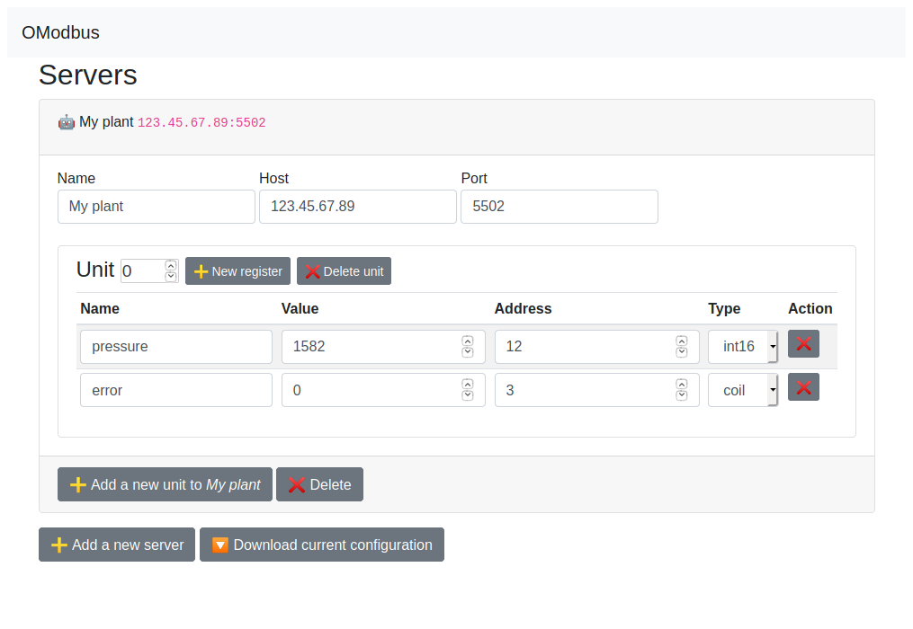

# omodbus

OModbus is a GUI to interact with modbus devices.



## Get started

Install the dependencies...

```bash
cd omodbus
npm install
```

...then start [Rollup](https://rollupjs.org):

```bash
npm run dev
```

Navigate to [localhost:5000](http://localhost:5000). You should see your app running. Edit a component file in `src`, save it, and reload the page to see your changes.
